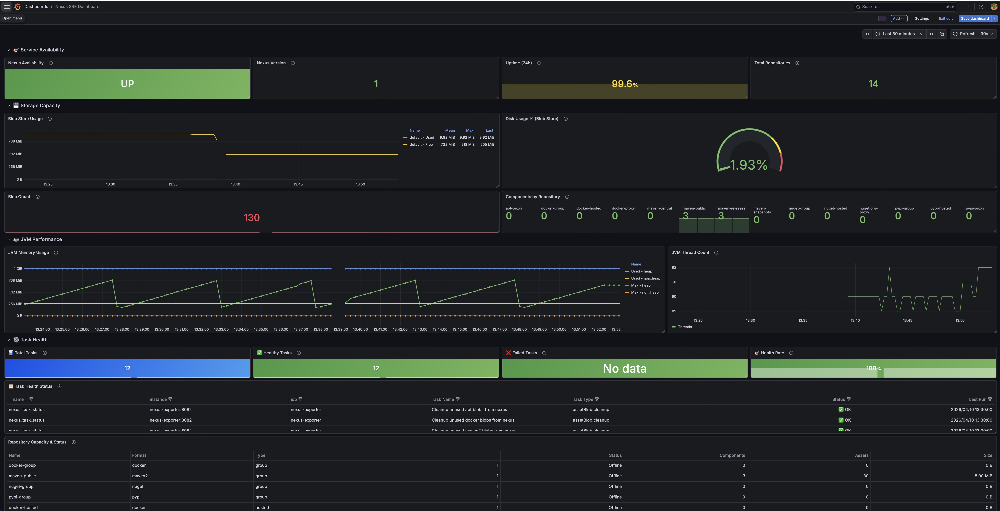

# Nexus Exporter

[](https://github.com/yimeng/nexus-exporter/releases)
[](https://golang.org/)
[](LICENSE)

[中文文档](README.zh.md) | English

A Prometheus Exporter written in Go for monitoring Sonatype Nexus Repository Manager 3.x.



## Features

- **System Status**: Monitor Nexus service health status
- **Blob Storage**: Monitor storage usage and blob count
- **Repositories**: Monitor repository information and component count
- **JVM Metrics**: Monitor memory usage and thread count
- **Tasks**: Monitor scheduled task execution status

## Quick Start

### Binary Deployment (Systemd)

Deploy nexus-exporter as a systemd service on Linux.

#### Prerequisites: Nexus User Permissions

The Nexus user account used by the exporter needs the following permissions:

| Permission | API Endpoint | Purpose | Grafana Panels |
|------------|--------------|---------|----------------|
| `nx-healthcheck-read` | `/service/rest/v1/status` | Check Nexus health | Service Availability |
| `nx-blobstores-read` | `/service/rest/v1/blobstores` | Read blob store metrics | Blob Store Usage, Disk Usage % |
| `nx-repository-view-*-*-read` | `/service/rest/v1/repositories` | List repositories | **Total Repositories** |
| `nx-repository-view-*-*-browse` | `/service/rest/v1/components` | Browse repository content | **Repository Capacity & Status**, **Components by Repository** |
| `nx-search-read` | `/service/rest/v1/search` | Search components | **Components by Repository** (alternative) |
| `nx-repository-view-*-*-browse` | `/service/rest/v1/assets` | Read asset information | Repository Size, Assets Count |
| `nx-tasks-read` | `/service/rest/v1/tasks` | Read task status | **Failed Tasks**, Task Health |
| `nx-metrics-read` | `/service/metrics/data` | Read JVM metrics | JVM Memory, JVM Thread Count |

**Note for Nexus 3.76.1+**: If the following panels show "No data":
- **Total Repositories**: Check `nx-repository-view-*-*-read` permission
- **Repository Capacity & Status** / **Components by Repository**: Check `nx-repository-view-*-*-browse` permission (NOT `nx-component-read`, this permission doesn't exist in Nexus 3.76.1)
- **Failed Tasks**: Check `nx-tasks-read` permission

**Important**: In Nexus 3.76.1, there is no `nx-component-read` or `nx-assets-read` permission. Use `nx-repository-view-*-*-browse` instead to access component and asset data.

**Recommended**: Use an admin account or create a dedicated service account with the above permissions.

For Nexus OSS, the default `admin` account has all required permissions.

To create a custom role with minimal permissions, go to **Nexus UI → Security → Roles → Create Role** and assign the permissions listed above.

**Quick fix for "No data" issues** - Add these essential permissions:
```
nx-repository-view-*-*-read
nx-repository-view-*-*-browse
nx-tasks-read
nx-blobstores-read
nx-metrics-all
nx-healthcheck-read
nx-healthcheck-summary-read
```

**Minimum required permissions (tested on Nexus 3.76.1):**
```
nx-blobstores-read
nx-healthcheck-read
nx-healthcheck-summary-read
nx-metrics-all
nx-repository-view-*-*-browse
nx-repository-view-*-*-read
nx-tasks-read
```

#### 1. Download Binary

```bash
# Detect architecture
ARCH=$(uname -m)
case $ARCH in
  x86_64) ARCH="amd64" ;;
  aarch64) ARCH="arm64" ;;
  *) echo "Unsupported architecture: $ARCH"; exit 1 ;;
esac

# Download latest release
curl -LO "https://github.com/yimeng/nexus-exporter/releases/latest/download/nexus-exporter-linux-${ARCH}"
sudo install -m 755 "nexus-exporter-linux-${ARCH}" /usr/local/bin/nexus-exporter
rm "nexus-exporter-linux-${ARCH}"
```

#### 2. Create User and Directories

```bash
# Create dedicated user
sudo useradd --system --no-create-home --shell /usr/sbin/nologin nexus-exporter

# Create configuration directory
sudo mkdir -p /etc/nexus-exporter
sudo chmod 750 /etc/nexus-exporter
```

#### 3. Configure

Create configuration file with Nexus credentials:

```bash
sudo tee /etc/nexus-exporter/nexus-exporter.conf << 'EOF'
NEXUS_URL=http://localhost:8081
NEXUS_USERNAME=admin
NEXUS_PASSWORD=your-nexus-password
EXPORTER_PORT=8082
LOG_LEVEL=info
EOF

# Secure the configuration file
sudo chmod 600 /etc/nexus-exporter/nexus-exporter.conf
sudo chown root:nexus-exporter /etc/nexus-exporter/nexus-exporter.conf
```

#### 4. Install Systemd Service

```bash
# Download service file
curl -L -o /tmp/nexus-exporter.service \
  https://raw.githubusercontent.com/yimeng/nexus-exporter/master/systemd/nexus-exporter.service

# Install and reload
sudo install -m 644 /tmp/nexus-exporter.service /etc/systemd/system/
sudo systemctl daemon-reload
```

Or create manually:

```bash
sudo tee /etc/systemd/system/nexus-exporter.service << 'EOF'
[Unit]
Description=Nexus Exporter for Prometheus
After=network.target

[Service]
Type=simple
User=nexus-exporter
Group=nexus-exporter
EnvironmentFile=/etc/nexus-exporter/nexus-exporter.conf
ExecStart=/usr/local/bin/nexus-exporter
Restart=always
RestartSec=5

[Install]
WantedBy=multi-user.target
EOF

sudo systemctl daemon-reload
```

#### 5. Start Service

```bash
# Enable and start service
sudo systemctl enable nexus-exporter
sudo systemctl start nexus-exporter

# Check status
sudo systemctl status nexus-exporter

# View logs
sudo journalctl -u nexus-exporter -f
```

#### 6. Verify

```bash
# Test metrics endpoint
curl http://localhost:8082/metrics
```

#### Troubleshooting

**Service fails to start with "Nexus password is required"**

If you see this error in logs:
```
Nexus password is required. Use --nexus.password, NEXUS_PASSWORD environment variable, or .env file
```

Check that:
1. Configuration file exists and has correct permissions:
   ```bash
   sudo ls -la /etc/nexus-exporter/nexus-exporter.conf
   # Should be: -rw------- root nexus-exporter
   ```

2. Environment variables are loaded (test with):
   ```bash
   sudo systemctl show nexus-exporter --property=Environment
   ```

3. Alternative: Use `--config` flag in service file:
   ```ini
   ExecStart=/usr/local/bin/nexus-exporter --config=/etc/nexus-exporter/nexus-exporter.conf
   ```

**Permission denied errors**

If you see 401/403 errors in logs, check:
1. Nexus user credentials are correct
2. Nexus user has required permissions (see Prerequisites section)
3. For non-admin users, ensure role includes: `nx-healthcheck-read`, `nx-blobstores-read`, `nx-repository-view-*-*-read`, `nx-tasks-read`, `nx-metrics-read`

---

### Docker Deployment

Run nexus-exporter using Docker or Docker Compose.

#### Option 1: Docker Run

```bash
docker run -d \
  --name nexus-exporter \
  --restart unless-stopped \
  -p 8082:8082 \
  -e NEXUS_URL="http://nexus:8081" \
  -e NEXUS_USERNAME="admin" \
  -e NEXUS_PASSWORD="your-nexus-password" \
  -e EXPORTER_PORT="8082" \
  -e LOG_LEVEL="info" \
  ghcr.io/yimeng/nexus-exporter:latest
```

#### Option 2: Docker Compose

Create `docker-compose.yml`:

```yaml
version: '3.8'

services:
  nexus-exporter:
    image: ghcr.io/yimeng/nexus-exporter:latest
    container_name: nexus-exporter
    restart: unless-stopped
    ports:
      - "8082:8082"
    environment:
      - NEXUS_URL=http://nexus:8081
      - NEXUS_USERNAME=admin
      - NEXUS_PASSWORD=${NEXUS_PASSWORD}
      - EXPORTER_PORT=8082
      - LOG_LEVEL=info
    healthcheck:
      test: ["CMD", "wget", "-q", "--spider", "http://localhost:8082/healthz"]
      interval: 30s
      timeout: 10s
      retries: 3
      start_period: 10s
```

Start with:

```bash
# Create .env file for sensitive data
echo "NEXUS_PASSWORD=your-nexus-password" > .env

# Start container
docker compose up -d

# View logs
docker compose logs -f

# Check status
docker compose ps
```

#### Option 3: Build from Source

```bash
# Clone repository
git clone https://github.com/yimeng/nexus-exporter.git
cd nexus-exporter

# Build image
docker build -t nexus-exporter:local .

# Run
docker run -d \
  --name nexus-exporter \
  -p 8082:8082 \
  -e NEXUS_PASSWORD="your-nexus-password" \
  nexus-exporter:local
```

---

### Monitoring Configuration

Configure your monitoring system to scrape metrics from nexus-exporter.

#### Prometheus

Add to your `prometheus.yml`:

```yaml
scrape_configs:
  - job_name: 'nexus-exporter'
    static_configs:
      - targets: ['nexus-exporter:8082']
    metrics_path: /metrics
    scrape_interval: 30s
    scrape_timeout: 10s
```

#### VictoriaMetrics

Using `scrape_config` file:

```yaml
# /etc/victoriametrics/scrape.yml
scrape_configs:
  - job_name: 'nexus-exporter'
    static_configs:
      - targets: ['nexus-exporter:8082']
        labels:
          instance: 'nexus-server-01'
          environment: 'production'
    metrics_path: /metrics
    scrape_interval: 30s
    scrape_timeout: 10s
```

Start VictoriaMetrics with scrape config:

```bash
victoria-metrics \
  -promscrape.config=/etc/victoriametrics/scrape.yml \
  -retentionPeriod=30d \
  -httpListenAddr=:8428
```

#### Docker Compose (Full Stack)

Complete monitoring stack with Nexus, Exporter, VictoriaMetrics and Grafana:

```yaml
version: '3.8'

services:
  nexus:
    image: sonatype/nexus3:3.76.1
    container_name: nexus
    ports:
      - "8081:8081"
    volumes:
      - nexus-data:/nexus-data
    environment:
      - INSTALL4J_ADD_VM_PARAMS=-Xms1g -Xmx1g

  nexus-exporter:
    image: ghcr.io/yimeng/nexus-exporter:latest
    container_name: nexus-exporter
    ports:
      - "8082:8082"
    environment:
      - NEXUS_URL=http://nexus:8081
      - NEXUS_USERNAME=admin
      - NEXUS_PASSWORD=${NEXUS_PASSWORD}
    depends_on:
      - nexus

  victoriametrics:
    image: victoriametrics/victoria-metrics:v1.102.0
    container_name: victoriametrics
    ports:
      - "8428:8428"
    volumes:
      - ./victoriametrics.yml:/etc/victoriametrics/scrape.yml:ro
      - vm-data:/victoria-metrics-data
    command:
      - '--promscrape.config=/etc/victoriametrics/scrape.yml'
      - '--storageDataPath=/victoria-metrics-data'
      - '--retentionPeriod=30d'

  grafana:
    image: grafana/grafana:12.4.0
    container_name: grafana
    ports:
      - "3001:3000"
    volumes:
      - grafana-data:/var/lib/grafana
    environment:
      - GF_SECURITY_ADMIN_PASSWORD=${GRAFANA_PASSWORD:-admin123}

volumes:
  nexus-data:
  vm-data:
  grafana-data:
```

`victoriametrics.yml`:

```yaml
scrape_configs:
  - job_name: 'nexus-exporter'
    static_configs:
      - targets: ['nexus-exporter:8082']
    metrics_path: /metrics
    scrape_interval: 30s
```

#### Alerting Rules (Prometheus/VictoriaMetrics)

```yaml
groups:
  - name: nexus-alerts
    rules:
      - alert: NexusDown
        expr: nexus_up == 0
        for: 1m
        labels:
          severity: critical
        annotations:
          summary: "Nexus service is down"
          description: "Nexus has been down for more than 1 minute"

      - alert: NexusHighDiskUsage
        expr: (nexus_blobstore_bytes_total / (nexus_blobstore_bytes_total + nexus_blobstore_bytes_free)) * 100 > 85
        for: 5m
        labels:
          severity: warning
        annotations:
          summary: "Nexus disk usage is high"
          description: "Blob store {{ $labels.name }} is {{ $value | humanize }}% full"

      - alert: NexusTaskFailed
        expr: nexus_task_status == 0
        for: 5m
        labels:
          severity: warning
        annotations:
          summary: "Nexus task is failing"
          description: "Task {{ $labels.name }} has failed"

      - alert: NexusHighJVMMemoryUsage
        expr: (nexus_jvm_memory_used_bytes / nexus_jvm_memory_max_bytes) * 100 > 80
        for: 5m
        labels:
          severity: warning
        annotations:
          summary: "Nexus JVM memory usage is high"
          description: "JVM {{ $labels.area }} memory usage is {{ $value | humanize }}%"
```

#### Grafana Data Source Configuration

**Prometheus Data Source:**
- URL: `http://prometheus:9090` (or VictoriaMetrics: `http://victoriametrics:8428`)
- Access: Server

**Dashboard Import:**
1. Go to Grafana → Create → Import
2. Enter dashboard ID (if published) or paste JSON
3. Select Prometheus/VictoriaMetrics data source

Dashboard JSON is available in `grafana/dashboards/nexus-sre-dashboard.json`

## Usage

### Command Line Flags

```bash
nexus-exporter [flags]
```

#### Available Flags

| Flag | Short | Environment Variable | Default | Description |
|------|-------|---------------------|---------|-------------|
| `--help` | `-h` | - | - | Show help information |
| `--version` | `-v` | - | - | Show version information |
| `--config` | - | - | - | Path to .env config file |
| `--nexus.url` | - | `NEXUS_URL` | `http://localhost:8081` | Nexus URL |
| `--nexus.username` | - | `NEXUS_USERNAME` | `admin` | Nexus username |
| `--nexus.password` | - | `NEXUS_PASSWORD` | - | Nexus password (required) |
| `--port` | - | `EXPORTER_PORT` | `8082` | Exporter listen port |
| `--insecure` | - | `NEXUS_INSECURE` | `false` | Skip TLS verification (for self-signed certificates) |
| `--log.level` | - | `LOG_LEVEL` | `info` | Log level (debug/info/warn/error) |

**Configuration Priority**: Command line flags > Environment variables > Config file (.env) > Default values

### Using Config File

Create a `.env` file:

```bash
cat > .env << EOF
NEXUS_URL=http://localhost:8081
NEXUS_USERNAME=admin
NEXUS_PASSWORD=<your-password>
EXPORTER_PORT=8082
NEXUS_INSECURE=false
LOG_LEVEL=info
EOF
```

Then run directly:

```bash
./nexus-exporter
```

Or specify config file path:

```bash
./nexus-exporter --config=/path/to/config.env
```

### Using Environment Variables

```bash
export NEXUS_URL="http://localhost:8081"
export NEXUS_USERNAME="admin"
export NEXUS_PASSWORD="<your-password>"
export EXPORTER_PORT="8082"

./nexus-exporter
```

### Using Command Line Flags

```bash
./nexus-exporter \
  --nexus.url=http://localhost:8081 \
  --nexus.username=admin \
  --nexus.password=<your-password> \
  --port=8082
```

### Docker with .env File

```bash
docker run -d \
  -p 8082:8082 \
  --env-file .env \
  ghcr.io/yimeng/nexus-exporter:latest
```

## Metrics

| Metric Name | Type | Description |
|-------------|------|-------------|
| `nexus_up` | Gauge | Nexus service availability (1=up, 0=down) |
| `nexus_version_info` | Gauge | Nexus version information |
| `nexus_blobstore_bytes_total` | Gauge | Total bytes in blob store |
| `nexus_blobstore_bytes_free` | Gauge | Available bytes in blob store |
| `nexus_blobstore_blobs_count` | Gauge | Number of blobs |
| `nexus_repository_info` | Gauge | Repository information (name, format, type, blob_store) |
| `nexus_repository_components_count` | Gauge | Number of components in repository |
| `nexus_repository_online` | Gauge | Repository online status (1=online, 0=offline) |
| `nexus_repository_size_bytes` | Gauge | Total size of repository in bytes |
| `nexus_repository_assets_count` | Gauge | Number of assets in repository |
| `nexus_jvm_memory_used_bytes` | Gauge | JVM memory usage |
| `nexus_jvm_memory_max_bytes` | Gauge | JVM memory maximum |
| `nexus_jvm_threads_count` | Gauge | JVM thread count |
| `nexus_task_status` | Gauge | Task status (1=healthy, 0=failed) |
| `nexus_task_last_run_timestamp` | Gauge | Task last run timestamp |

## Prometheus Configuration

```yaml
scrape_configs:
  - job_name: 'nexus'
    static_configs:
      - targets: ['localhost:8082']
    metrics_path: /metrics
```

## Alerting Rules Example

```yaml
groups:
  - name: nexus
    rules:
      - alert: NexusDown
        expr: nexus_up == 0
        for: 1m
        labels:
          severity: critical
        annotations:
          summary: "Nexus service is down"
          
      - alert: NexusBlobStoreLowSpace
        expr: nexus_blobstore_bytes_free / nexus_blobstore_bytes_total < 0.1
        for: 5m
        labels:
          severity: warning
        annotations:
          summary: "Nexus Blob Store low disk space"
          
      - alert: NexusTaskFailed
        expr: nexus_task_status == 0
        for: 1m
        labels:
          severity: warning
        annotations:
          summary: "Nexus task execution failed"
```

## Building

```bash
# Build
go build -o nexus-exporter .

# Or use Makefile
make build

# Build Docker image
make docker
```

## API Endpoints

| Endpoint | Description |
|----------|-------------|
| `/metrics` | Prometheus metrics |
| `/healthz` | Health check |
| `/` | Status page |

## Troubleshooting

### HTTPS/HTTP Mismatch Error

**Error**: `server gave HTTP response to HTTPS client`

**Solution**: Your Nexus server is using HTTP, but you specified HTTPS. Change the URL:
```bash
# Wrong
--nexus.url=https://192.168.0.110:8081

# Correct
--nexus.url=http://192.168.0.110:8081
```

### TLS Certificate Error

**Error**: `certificate signed by unknown authority`

**Solution**: If using a self-signed certificate, add the `--insecure` flag:
```bash
./nexus-exporter --nexus.url=https://192.168.0.110:8081 --nexus.password=<your-password> --insecure
```

Or add to `.env` config file:
```bash
NEXUS_URL=https://192.168.0.110:8081
NEXUS_INSECURE=true
```

### Normal HTTPS Certificate (Non Self-Signed)

If Nexus uses a valid HTTPS certificate (e.g., Let's Encrypt or enterprise CA), **no special flags are needed**:
```bash
./nexus-exporter --nexus.url=https://nexus.example.com --nexus.password=<your-password>
```

## Development

```bash
# Install dependencies
go mod tidy

# Run tests
go test ./...

# Format code
go fmt ./...
```

## License

MIT
